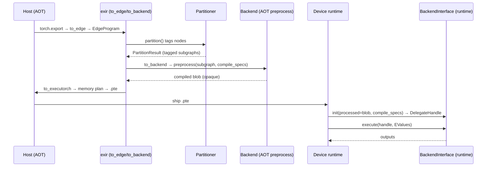

# Flows — ExecuTorch

> Source anchors `◐` (ExecuTorch `main @0d904b6bae60`). Behavior not run here (pip pulls full
> PyTorch). Anchors are `file → symbol`.

---

## Flow: `to_edge` → `to_backend` → `.pte` (lowering & delegation)

**Doc type:** explanation (traced flow)
**Audience:** a developer debugging why a subgraph wasn't delegated, or a `.pte` that won't run
**Before you begin:** read `CONCEPTS.md → BackendInterface` and `Partitioner`
**Owner:** _(example instance — unowned)_
**Trigger:** an engineer lowers an exported PyTorch model for a target backend
**Source verified against:** ExecuTorch `main @0d904b6bae60` ◐
**Behavior:** not run in this environment ◐

> One canonical AOT path (export → lower → serialize) plus the on-device load/execute, and the
> required error branch: a tagged subgraph the backend cannot compile.

### In one line

AOT: export → `to_edge` → partitioner tags subgraphs → `to_backend` compiles each via the
backend's `preprocess` → `to_executorch` memory-plans and serializes `.pte`. On device: load
`.pte`, `init` each delegate with its blob, `execute`.

### Sequence Diagram

**Diagram verification:** ◐ Read-only (from source docs; not run here).

### Call Chain
| # | Anchor (file → symbol) | What happens | Verification |
|---|---|---|---|
| 1 | `exir → to_edge` | Exported program → `EdgeProgram` (edge dialect) | ◐ |
| 2 | `exir → Partitioner.partition` | Tag nodes for a backend → `PartitionResult` | ◐ |
| 3 | `exir → to_backend` → backend `preprocess(edge_program, compile_specs)` | Compile each tagged subgraph → opaque blob | ◐ |
| 4 | `exir → to_executorch` | Memory planning + serialize `.pte` (program + blobs) | ◐ |
| 5 | `runtime/executor → Method::execute` | Load `.pte`, run program | ◐ |
| 6 | `runtime/backend/interface.h → BackendInterface::init` / `execute` | Delegate runs its subgraph from the blob | ◐ |

### Cross-Module / Boundaries
| Step → Step | Boundary | Mechanism |
|---|---|---|
| 2 → 3 | partition → backend | tagged subgraph handed to the backend's `preprocess` |
| 4 → 5 | AOT host → device | the `.pte` artifact (serialized) |
| 5 → 6 | runtime → delegate | `processed` blob + `CompileSpec` → `DelegateHandle` |

Most cost is paid **AOT** (steps 1–4); the device path (5–6) is intentionally light.

### Primary Error / Early-Exit Branch (required for L3)
- **Where it diverges:** step 3 — the backend's `preprocess` cannot compile a tagged subgraph
  (unsupported op/dtype/shape for that accelerator).
- **What triggers it:** an over-eager `Partitioner` tagging nodes the backend can't handle.
- **Signal:** lowering fails **AOT** (exception during `to_backend`), or — if a bad blob slips
  through — `BackendInterface::init` fails at device load.
- **No silent fallback for delegated ops:** unlike ORT's CPU fallback, a delegated subgraph
  that fails is an error, not a re-run on CPU. (Non-delegated ops do use portable kernels.)

### Related Concepts
- `CONCEPTS.md → BackendInterface` (steps 3, 6) and `Partitioner` (step 2).

### Notes
- **The `.pte` is self-contained** (program + delegate blobs + memory plan) — debugging a
  device failure usually means inspecting how it was lowered AOT, not the runtime.
