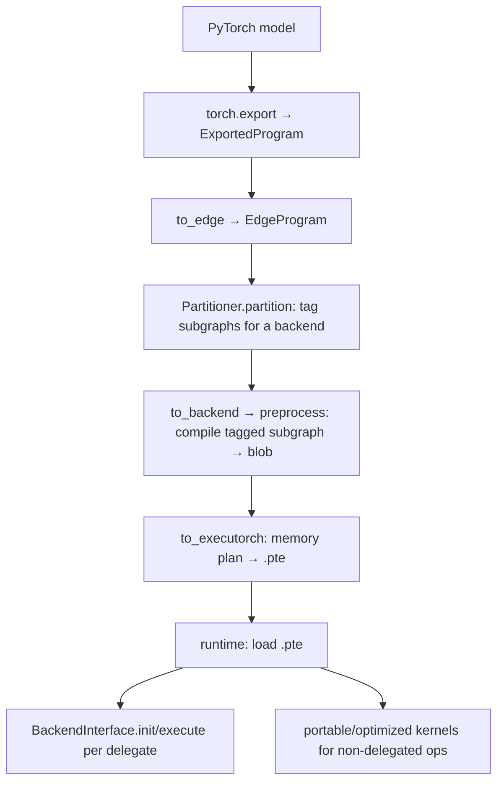

# Project Overview — ExecuTorch

**Doc type:** reference (map + positioning)
**Audience:** a developer new to ExecuTorch who knows PyTorch + C++
**You are assumed to know:** PyTorch `export`, and what a computation graph is
**Before you begin:** none — this is the starting point
**Owner:** _(example instance — unowned)_
**Source anchors verified against:** ExecuTorch `main @0d904b6bae60` (GitHub, 2026) ◐
**Behavior:** not run in this environment (pip pulls full PyTorch) ◐

> Anchors are `file → symbol`; re-verify before use. All claims here are `◐` (read), not run.

## One-Sentence Positioning

ExecuTorch is PyTorch's on-device (edge) inference runtime: it lowers an exported PyTorch
program **ahead of time** into a compact `.pte` file — delegating subgraphs to hardware
backends — and runs it with a small, dependency-light C++ runtime.

## Problem and Audience

Mobile/embedded targets can't ship full PyTorch. ExecuTorch splits the work: heavy
compilation/partitioning happens **AOT** on a host; the device runs a tiny runtime that loads
`.pte` and dispatches to **delegates** (backends like XNNPACK, Core ML, **Qualcomm QNN**,
Vulkan) or to portable CPU kernels. Users are edge-ML engineers shipping models to phones/MCUs.

## Tech Stack and Platforms

- **Language(s):** Python (AOT export/lowering) + C++ (runtime)
- **Build system:** CMake (runtime); `pip install executorch` (AOT tooling, pulls PyTorch)
- **Model artifact:** `.pte` (serialized program + delegate blobs + memory plan)
- **Platforms:** Android, iOS, Linux, microcontrollers

## Entry Points

Process/binary start points. The *callable* API (AOT lowering + runtime) is in `API.md`.

| Entry | Anchor | Notes |
|---|---|---|
| AOT lowering | `to_edge(...)` → `to_backend(...)` → `to_executorch()` (Python API) | Produces the `.pte` |
| Runtime load+run | `runtime/executor/` → `Method::execute` (C++) | On-device execution of `.pte` |
| Backend registration | `runtime/backend/interface.h → register_backend` | Where a delegate is plugged in |

## Structural Map

Markers: 🔴 largest / most code mass · 🟡 small but core · ⚪ skippable first pass · 🟢 standard

```
executorch/
  exir/                     🔴 Export IR + passes (EdgeProgram, to_edge, to_backend)
  backends/                 🔴 Delegates: xnnpack, coreml, qualcomm (QNN), vulkan, …
  runtime/
    backend/                🟡 BackendInterface + registration (interface.h)
    executor/               🔴 The on-device executor (loads .pte, runs Methods)
    kernel/                 🟡 Kernel registry / dispatch
  kernels/                  🔴 Portable + optimized operator implementations
  devtools/, extension/     🟢 Tooling, higher-level helpers
  docs/source/              🟢 Official docs (delegate/partitioner, kernels)
```

### Most important areas
| Area | Role |
|---|---|
| `exir/` | `to_edge`/`to_backend` lowering + partitioner plumbing |
| `runtime/backend/interface.h` | `BackendInterface` (delegate contract) |
| `backends/<name>/` | One delegate each (incl. `qualcomm` = QNN) |
| `kernels/` + `runtime/kernel/` | Operator implementations + dispatch |

## Top-Level Architecture (the shape)



**Diagram verification:** ◐ Read-only (from source docs; not run here).

## Notes and Surprises
- **AOT vs on-device split** is the defining trait — unlike ORT (which partitions at session
  init), ExecuTorch bakes delegation into the `.pte` ahead of time.
- **Delegate vs kernel are different extension points** — a *backend/delegate* runs a whole
  tagged subgraph; a *kernel* runs one op on CPU. Adding each is a different axis (`API.md`).
- **Selective build:** only the operators a model needs are compiled into the runtime (size
  matters on edge) — so a missing op is a build/registration error, not a runtime fallback.
