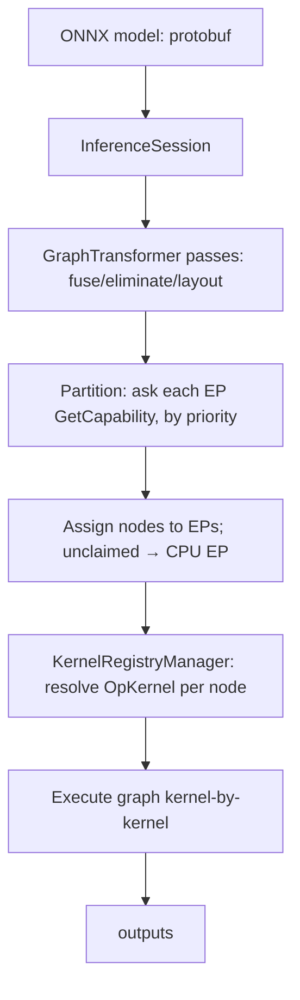

# Project Overview — ONNX Runtime

**Doc type:** reference (map + positioning)
**Audience:** a developer new to ONNX Runtime who knows C++ and basic ML inference
**You are assumed to know:** what an ONNX model / computation graph is
**Before you begin:** none — this is the starting point
**Owner:** _(example instance — unowned)_
**Source anchors verified against:** ONNX Runtime `main @90c095d1e309` (GitHub, 2026) ◐
**Runtime behavior verified against:** `onnxruntime` 1.26.0 (pip), 2026-06-06 ✓

> Anchors are `file → symbol`; re-verify before use. Source claims are `◐` (read), runtime
> behavior is `✓` (run).

## One-Sentence Positioning

ONNX Runtime is a cross-platform inference (and training) engine that loads an ONNX model
graph, optimizes and partitions it across pluggable hardware backends ("Execution
Providers"), and executes it kernel-by-kernel.

## Problem and Audience

Teams have models in many frameworks and want one fast, portable runtime across CPU/GPU/NPU
without rewriting per device. ONNX Runtime solves this with a common graph + a **backend
plug-in interface** (the Execution Provider), so the same model runs on CPU, CUDA, TensorRT,
QNN (Qualcomm), CoreML, etc. Users are ML-systems and application engineers shipping
inference.

## Tech Stack and Platforms

- **Language(s):** C++ core; C/C++/C#/Python/Java/JS APIs
- **Build system:** CMake (large); Python wheels via `pip install onnxruntime`
- **Math kernels:** MLAS (in-tree) + Eigen; per-EP libraries for accelerators
- **Model format:** ONNX (protobuf)
- **Platforms:** Linux/Windows/macOS/Android/iOS/web

## Entry Points

Process/binary start points. The *callable* API surface (sessions, custom op, custom EP) is
in `API.md` → Provided API Surface.

| Entry | Anchor | Notes |
|---|---|---|
| Python session | `onnxruntime.InferenceSession` (pip module) | The most common entry; `sess.run(...)` |
| C API session | `include/onnxruntime/core/session/onnxruntime_c_api.h → OrtApi` | Stable ABI used by all language bindings |
| Session impl | `onnxruntime/core/session/inference_session.{h,cc} → InferenceSession::Run` | Where a run is orchestrated |

## Structural Map

Markers: 🔴 largest / most code mass · 🟡 small but core · ⚪ skippable first pass · 🟢 standard

```
onnxruntime/
  include/onnxruntime/core/   🟡 Public headers: the EP interface, C API, optimizer base
  onnxruntime/core/
    framework/                🔴 Session framework: EP plumbing, kernel registry, allocators
    providers/                🔴 Execution Providers (cpu, cuda, tensorrt, qnn, coreml, …)
    optimizer/                🔴 GraphTransformer passes (fusion, elimination, layout)
    graph/                    🟡 Graph/Model IR (ONNX graph in memory)
    session/                  🟡 InferenceSession orchestration + C API
    providers/cpu/            🔴 The default fallback EP + reference kernels
    mlas/                     🟢 In-tree math kernel library
  onnxruntime/python/         🟢 pybind layer for the Python API
  csharp/ java/ js/           ⚪ Other language bindings (skip first pass)
```

### Most important areas

| Area | Role in one line |
|---|---|
| `core/framework/execution_provider.h` | The `IExecutionProvider` backend interface |
| `core/framework/kernel_registry_manager.{h,cc}` | Layered kernel resolution |
| `core/optimizer/graph_transformer.h` | Base class for graph-optimization passes |
| `core/providers/cpu/` | Default EP + reference kernels (the fallback) |
| `core/session/inference_session.cc` | `Run()` orchestration |

## Top-Level Architecture (the shape)



**Diagram verification:** ◐ Read-only (architecture from source/docs); the run itself is
verified behaviorally in `FLOWS.md`.

## Notes and Surprises
- **ORT, not the EP, owns partitioning.** An EP only *proposes* sub-graphs via
  `GetCapability`; the runtime decides assignment. See `CONCEPTS.md`.
- **CPU EP is the universal fallback** — any node no accelerator claims runs on CPU, so a
  model always runs (maybe slowly). This is the key to "it works everywhere."
- **The op/kernel registry and the EP interface are different extension points** — adding an
  *op* ≠ adding a *backend*. See `API.md`.
