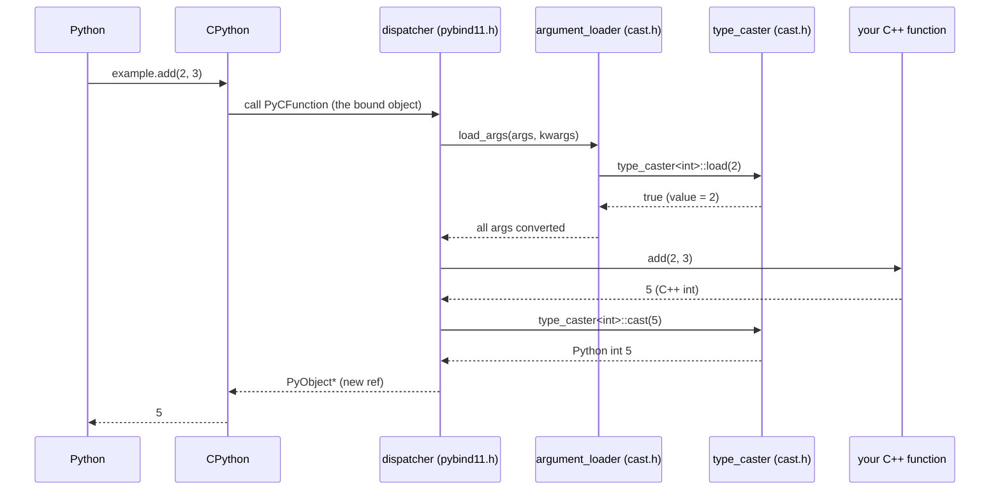

# Flows — pybind11

> Illustrative reference instance. Steps are `◐` (read-only) with `file → symbol`
> anchors. Re-verify against your checkout before acting.

---

## Flow: Calling a Bound C++ Function from Python

**Doc type:** explanation (traced flow)
**Audience:** a developer debugging argument conversion, overloads, or a TypeError
**Before you begin:** read `CONCEPTS.md → type_caster` (every step uses it)
**Owner:** _(example instance — unowned)_
**Trigger:** Python code calls a function that was bound with `m.def(...)`, e.g.
`example.add(2, 3)`
**Last verified against commit:** 6079989 (pybind11 3.1.0)   **Status:** ◐ Read-only
**Last verified date:** 2026-06-06

> One canonical path — the single-overload success case — omitting the multi-overload
> and keyword-argument details. The required error branch is the "no matching
> overload" TypeError.

### In one line

CPython calls pybind11's dispatcher, which uses `type_caster::load` to convert each
Python argument to C++, calls your function, and converts the result back with
`type_caster::cast`.

### Sequence Diagram

**Diagram verification:** ◐ Read-only — same tag rules as prose.

### Call Chain

| # | Anchor (file → symbol) | What happens | Verification |
|---|---|---|---|
| 1 | CPython call machinery | Python `example.add(2,3)` invokes the bound object's `PyCFunction` | ◐ |
| 2 | `include/pybind11/pybind11.h → dispatcher` (search `"dispatcher"`) | pybind11's C entry; iterates the overload chain | ◐ |
| 3 | `include/pybind11/cast.h → argument_loader::load_args` | Drive a `type_caster` for each parameter | ◐ |
| 4 | `include/pybind11/cast.h → type_caster<int>::load` | Python int → C++ `int`; returns `false` to reject an overload | ◐ |
| 5 | `include/pybind11/pybind11.h` (the stored call lambda) | Invoke the actual C++ function with the loaded args | ◐ |
| 6 | `include/pybind11/cast.h → type_caster<int>::cast` | C++ result → a new Python object | ◐ |
| 7 | `include/pybind11/detail/internals.h → get_internals` | (for bound-class args/returns) look up the registered Python type | ◐ |

### Cross-Module / Boundaries

| Step → Step | Boundary type | Mechanism |
|---|---|---|
| 1 → 2 | Python → C++ | CPython `PyCFunction` pointer registered by `cpp_function` |
| 4 | Python value → C++ value | `type_caster::load` (data crosses the language boundary) |
| 6 | C++ value → Python value | `type_caster::cast` |

The **GIL is held throughout** — the dispatcher runs as a normal Python call. Any C++
code that releases the GIL (`gil_scoped_release`) must re-acquire it before steps 4, 6,
or 7 touch Python objects.

### Primary Error / Early-Exit Branch (required for L3)

- **Where it diverges:** step 4 — if `type_caster<Arg>::load` returns `false` for a
  candidate, the dispatcher tries the next overload; if **none** match, it falls
  through to the error path at the end of `dispatcher` (`pybind11.h`).
- **What triggers it:** the Python argument types do not match any bound overload
  (e.g. `example.add("a", 3)`).
- **Literal error signal:** `TypeError: add(): incompatible function arguments. The
  following argument types are supported:` followed by the overload signatures. (Built
  in `pybind11.h` / `detail/type_caster_base.h`.)
- **Where it ends up:** a Python `TypeError` is raised; no C++ function is called.

### Related Concepts

- `CONCEPTS.md → type_caster` (steps 3–6), `internals` (step 7), and `handle`/`object`
  (the references managed across the boundary).

### Notes

- **Overload resolution is "try each caster."** There is no static type dispatch from
  Python; pybind11 attempts each overload's casters in registration order, optionally
  with a second pass allowing implicit conversions (`convert = true`).
