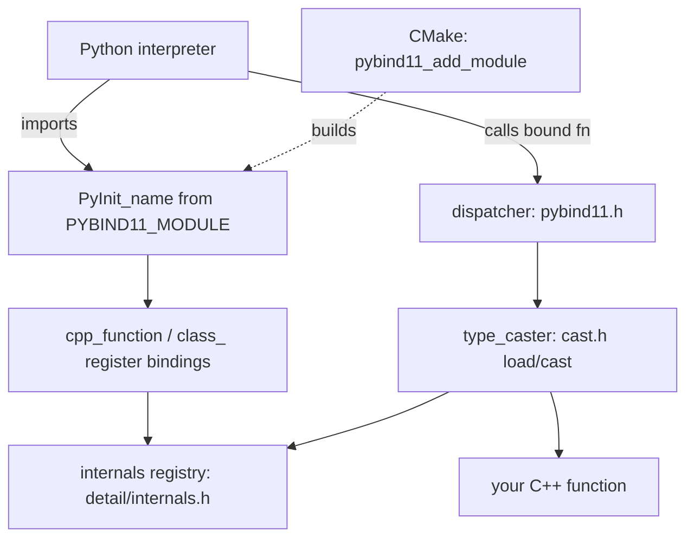

# Project Overview — pybind11

**Doc type:** reference (map + positioning)
**Audience:** a developer new to pybind11 who knows some C++ and some Python
**You are assumed to know:** C++ templates, basic CPython (PyObject, refcounts), CMake
**Before you begin:** none — this is the starting point
**Owner:** _(example instance — unowned)_
**Last verified against commit:** _(fill from your checkout)_   **Status:** ◐ Read-only
**Last verified date:** _(fill in)_

> Illustrative reference instance. Anchors are `file → symbol`; re-verify before use.

## One-Sentence Positioning

pybind11 is a lightweight, header-only C++11 library that exposes C++ types and
functions to Python (and Python back to C++), so native code can be imported as an
ordinary Python module.

## Problem and Audience

People with existing C++ code want to call it from Python without hand-writing the
CPython C-API glue (which is verbose and error-prone). pybind11 generates that glue
from concise C++ declarations, using templates and RTTI to translate values at the
boundary. Its users are C++ library authors shipping Python bindings, and Python
developers who need native-speed extensions.

## Tech Stack and Platforms

- **Language(s):** C++11+ (the library, header-only); Python (tests, packaging glue)
- **Build system:** **CMake** (primary) — also setuptools / scikit-build for wheels
- **Target platforms:** Linux, macOS, Windows; CPython and PyPy
- **Test framework:** C++ test modules built by CMake, exercised by **pytest**

## Entry Points

There is no `main()` — pybind11 is a library. The meaningful entry points are macros,
templates, and CMake functions.

| Entry | Anchor | Notes |
|---|---|---|
| Module definition macro | `include/pybind11/pybind11.h → PYBIND11_MODULE` (search `"PYBIND11_MODULE"`) | Expands to the CPython `PyInit_<name>` module-init function. |
| CMake module helper | `tools/pybind11NewTools.cmake → pybind11_add_module` | Adds a Python extension target with the right flags/suffix. |
| Function binding | `include/pybind11/pybind11.h → cpp_function` | Wraps a C++ callable as a Python-callable object. |
| Class binding | `include/pybind11/pybind11.h → class_` | Registers a C++ type as a Python type. |

## Structural Map

Markers: 🔴 largest / most code mass · 🟡 small but core · ⚪ skippable first pass · 🟢 standard

```
pybind11/
  include/pybind11/        🔴 The whole library (header-only): the code lives here
    pybind11.h             🔴 Top-level API: module_, cpp_function, class_, the dispatcher
    cast.h                 🔴 type_caster<T>: convert C++ <-> Python (load / cast)
    pytypes.h              🔴 handle / object and Python type wrappers (refcounting)
    detail/                🟡 Internals: internals.h, type_caster_base.h, init.h
    numpy.h, stl.h, eigen/ 🟢 Optional casters for arrays, STL containers, Eigen
  tools/                   🟡 CMake helpers: pybind11NewTools.cmake, pybind11Common.cmake
  tests/                   🟢 C++ test modules (built by CMake) + pytest files
  docs/                    🟢 Sphinx documentation
```

### Most important headers in `include/pybind11/`

| Header | Role in one line |
|---|---|
| `pybind11.h` | The public API and the function-call **dispatcher** that handles overloads |
| `cast.h` | `type_caster<T>` — the core boundary translation (`load` = Py→C++, `cast` = C++→Py) |
| `pytypes.h` | `handle` (borrowed ref) and `object` (owning ref); Python type wrappers |
| `detail/internals.h` | The per-interpreter `internals` registry of bound types |
| `detail/type_caster_base.h` | Generic caster + instance lookup for bound C++ classes |
| `gil.h` | `gil_scoped_acquire` / `gil_scoped_release` (split out in newer versions) |

### Directories to skip on first pass

| Dir | Reason |
|---|---|
| `docs/` | Documentation, not library logic. |
| `tests/` (initially) | Read one test to learn a feature, but not on the first scan. |

## Top-Level Architecture (the shape)



**Diagram verification:** ◐ Read-only — reflects the documented architecture, not a
live trace.

## Notes and Surprises

- **Header-only.** There is no compiled pybind11 library; everything is in
  `include/`. "Building pybind11" means building its *tests* or a *consumer module*.
- **RTTI and visibility matter.** Bound types are keyed by `std::type_index`, so
  inconsistent symbol visibility across translation units can break type lookup. See
  the invariants registry in `INDEX.md`.
- **The GIL is everywhere.** Any code touching Python objects must hold the GIL. This
  is the most common source of crashes for newcomers. See `CONCEPTS.md`.
- **Versions move headers.** `gil.h`, `typing.h`, etc. were split out of older
  monolithic headers. Confirm header locations on your checkout.
