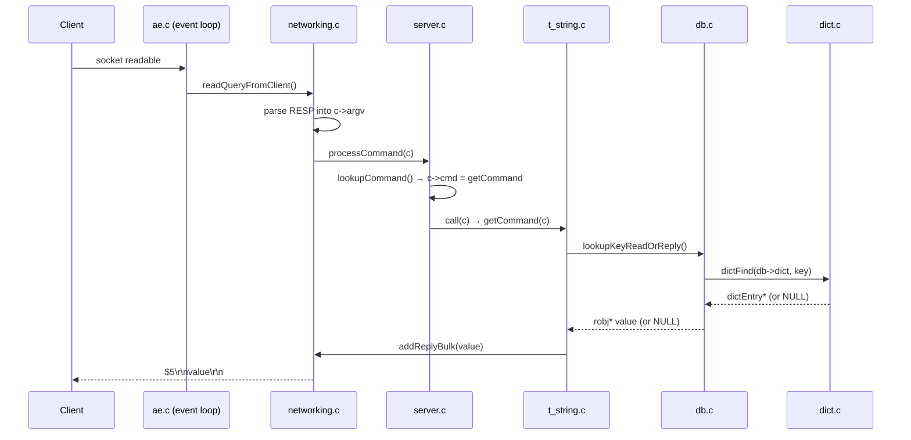

# Flows — Redis

> Illustrative reference instance. Steps are `◐` (read-only) with `file → symbol`
> anchors. Re-verify against your checkout before acting.

---

## Flow: Life of a `GET`

**Doc type:** explanation (traced flow)
**Audience:** a developer who wants to see how a command runs end to end
**Before you begin:** read `CONCEPTS.md → dict` (the lookup step uses it)
**Owner:** _(example instance — unowned)_
**Trigger:** a client sends `GET <key>` over a TCP connection (RESP protocol)
**Last verified against commit:** _(fill from your checkout)_   **Status:** ◐ Read-only
**Last verified date:** _(fill in)_

> One canonical path, omitted aggressively (the "Life of a Pixel" lesson). The happy
> path returns a string value; the required error branch is WRONGTYPE.

### In one line

The event loop reads the socket, parses RESP into `argv`, dispatches to `getCommand`,
which looks the key up in the keyspace `dict` and writes a bulk-string reply.

### Sequence Diagram

**Diagram verification:** ◐ Read-only — same tag rules as prose.

### Call Chain

| # | Anchor (file → symbol) | What happens | Verification |
|---|---|---|---|
| 1 | `src/ae.c → aeProcessEvents` | Event loop sees the socket is readable, fires the read handler | ◐ |
| 2 | `src/networking.c → readQueryFromClient` | Read bytes from the client socket into the query buffer | ◐ |
| 3 | `src/networking.c → processInputBuffer` | Parse RESP into `c->argv` / `c->argc` | ◐ |
| 4 | `src/server.c → processCommand` | Validate, then look up the command for `argv[0]` | ◐ |
| 5 | `src/server.c → call` | Invoke `c->cmd->proc(c)` = `getCommand` | ◐ |
| 6 | `src/t_string.c → getCommand → getGenericCommand` | The GET implementation | ◐ |
| 7 | `src/db.c → lookupKeyReadOrReply → lookupKeyRead → lookupKeyReadWithFlags` | Keyspace read; triggers lazy expiration | ◐ |
| 8 | `src/db.c → lookupKey` → `src/dict.c → dictFind` | Hash-table lookup (checks `ht[1]` too if rehashing) | ◐ |
| 9 | `src/networking.c → addReplyBulk` | Encode the value as a RESP bulk string into the output buffer | ◐ |
| 10 | `src/networking.c → writeToClient` | Event loop flushes the reply to the socket | ◐ |

### Cross-Module / Boundaries

| Step → Step | Boundary type | Mechanism |
|---|---|---|
| 1 → 2 | Event loop → networking | File-event callback registered via `connSetReadHandler` |
| 5 → 6 | Generic dispatch → type command | Function pointer `c->cmd->proc` |
| 7 → 8 | Keyspace → hash table | Direct call into the `dict` API |

There is **no process or thread boundary** on this path: command execution is
single-threaded. (I/O threads, if enabled, only move bytes in steps 2 and 10 — never
the command logic in 4–9.) This is *why* the lookup needs no locking.

### Primary Error / Early-Exit Branch (required for L3)

- **Where it diverges:** step 7, inside `getGenericCommand`, after the value is
  fetched: `src/object.c → checkType` (search `"checkType"`).
- **What triggers it:** the key exists but holds a non-string type (e.g. a hash).
- **Literal error signal:** `WRONGTYPE Operation against a key holding the wrong kind
  of value` — the shared reply `shared.wrongtypeerr` (`src/server.c`).
- **Where it ends up:** `addReplyError` writes the `-WRONGTYPE …` line; the command
  returns without touching the value.
- **The other early exit:** key missing → `addReplyNull` (RESP `$-1` / `_\r\n`),
  *not* an error.

### Related Concepts

- `CONCEPTS.md → dict` (step 8) and `redisObject` (the value returned in step 9).

### Notes

- **Lazy expiration is on this path.** Step 7 calls `expireIfNeeded`
  (`src/db.c`), so a logically-expired key can be deleted *during a read*. A `GET`
  is not purely read-only from the keyspace's point of view.

---

## Flow Index

| Flow Name | Trigger | Status |
|---|---|---|
| Life of a `GET` | client sends `GET key` | ◐ Read-only |
