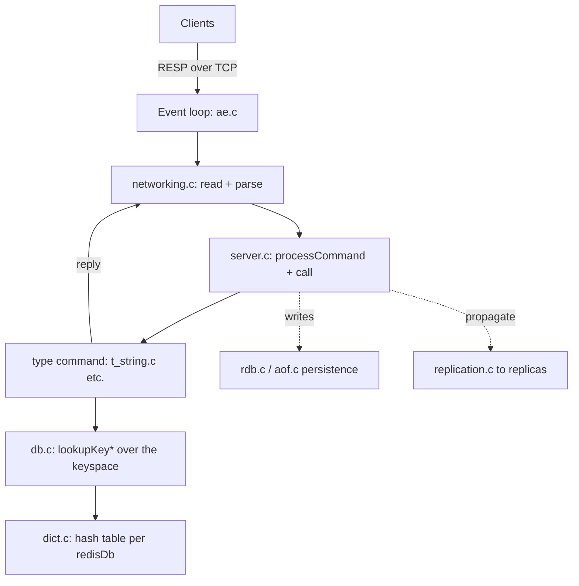

# Project Overview — Redis

**Doc type:** reference (map + positioning)
**Audience:** a developer new to the Redis codebase who knows C
**You are assumed to know:** C, sockets, basic data structures
**Before you begin:** none — this is the starting point
**Owner:** _(example instance — unowned)_
**Last verified against commit:** 4625b89 (redis unstable)   **Status:** ◐ Read-only
**Last verified date:** 2026-06-06

> Illustrative reference instance. Anchors are `file → symbol`; re-verify before use.

## One-Sentence Positioning

Redis is an in-memory data-structure store — used as a database, cache, and message
broker — that keeps all data in RAM for speed and serves clients over a simple
text-based protocol from a single-threaded event loop.

## Problem and Audience

Applications need sub-millisecond access to shared state: caches, counters, queues,
session stores, leaderboards. Redis solves this by holding native data structures
(strings, hashes, sorted sets, streams) in memory and exposing atomic operations on
them over the network. Its users are backend engineers who need a fast, simple
remote data store with rich types.

## Tech Stack and Platforms

- **Language(s):** C (core); Tcl (test suite); Lua (embedded scripting)
- **Frameworks / runtimes:** none — a custom event loop (`ae`) over epoll / kqueue
- **Target platforms:** Linux and macOS primarily; other Unix-likes
- **Build system:** `make` (plain Makefiles)
- **Test framework:** a Tcl harness (`./runtest`)

## Entry Points

Process/binary start points. The *callable* API surface (the RESP command set, the
module API) is in `API.md` → Provided API Surface.

| Entry | Anchor | Notes |
|---|---|---|
| Server `main()` | `src/server.c → main` (search `"int main(int argc"`) | Initializes config, the event loop, listeners; then runs `aeMain`. |
| Event loop | `src/ae.c → aeMain` (search `"void aeMain"`) | The heart: waits for socket events, dispatches callbacks. |
| CLI | `src/redis-cli.c → main` | The `redis-cli` client binary. |
| Test runner | `tests/test_helper.tcl` via `./runtest` | Spawns a server and runs Tcl test files. |

## Structural Map

Markers: 🔴 largest / most code mass · 🟡 small but core · ⚪ skippable first pass · 🟢 standard

```
redis/
  src/            🔴 The server: event loop, commands, data types, persistence, replication
  src/commands/   🟡 Per-command metadata (JSON specs); generated into the command table
  deps/           ⚪ Vendored: jemalloc, lua, hiredis, linenoise — skip on first pass
  tests/          🟢 Tcl integration tests + unit tests
  utils/          🟢 Helper scripts (cluster setup, lru simulation, etc.)
```

### Largest / most important files in `src/`

| File | Role in one line |
|---|---|
| `server.c` / `server.h` | Startup, the command-dispatch core (`processCommand`, `call`) |
| `networking.c` | Read client input, parse the protocol, build replies (`addReply*`) |
| `dict.c` / `dict.h` | The hash table behind the keyspace, with incremental rehashing |
| `t_string.c`, `t_hash.c`, `t_zset.c`, … | Command implementations per data type |
| `db.c` | Keyspace access: `lookupKeyRead`, `lookupKeyWrite`, expiration |
| `object.c` | `redisObject` lifecycle: creation, encoding, refcounting |
| `ae.c` | The event loop abstraction over epoll / kqueue / select |
| `rdb.c`, `aof.c` | Persistence: snapshot (RDB) and append-only file (AOF) |
| `replication.c`, `cluster.c` | Replication and Cluster mode |

### Directories to skip on first pass

| Dir | Reason |
|---|---|
| `deps/` | Third-party (jemalloc allocator, Lua, hiredis, linenoise). Not Redis logic. |

## Top-Level Architecture (the shape)



**Diagram verification:** ◐ Read-only — reflects the documented architecture, not a
live trace.

## Notes and Surprises

- **Single-threaded command execution.** Despite I/O threads (since 6.0), the command
  logic itself runs on one thread. This is the most important fact about Redis: it is
  *why* commands are atomic and need no locks. See `CONCEPTS.md` and the invariants
  registry in `INDEX.md`.
- **The command table is generated.** Since 7.0, command metadata lives in
  `src/commands/*.json` and is generated into `commands.def`. Searching for a command
  name as a string may land in generated code; the implementation is the
  `*Command` function (e.g., `getCommand`).
- **The keyspace structure changed.** In Redis ≤7.2 the keyspace is `redisDb.dict`;
  7.4+ wraps it in a `kvstore` of many dicts. Verify which your checkout uses.
