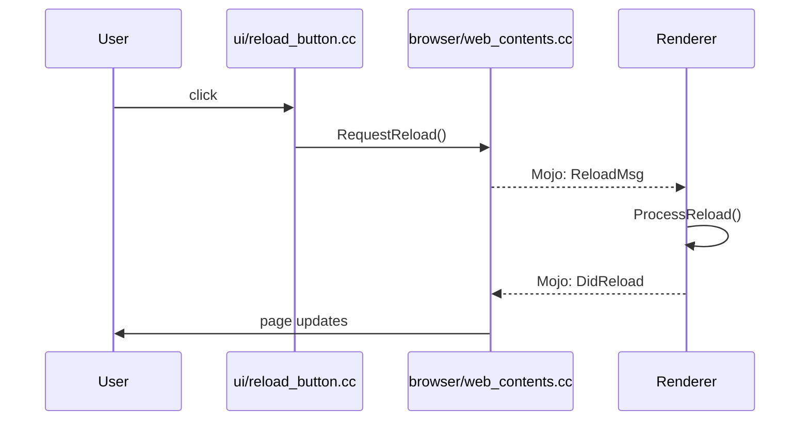
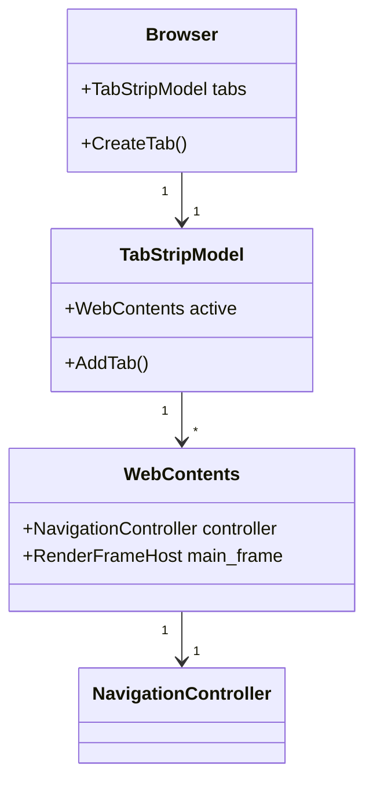

# Examples

Concrete examples of how this template is used on real codebases. These are illustrative only. Do not copy them into your own notes; they belong here, not in your project's working files.

> **Want a complete, filled example?** See the `examples/` directory at the repository
> root — full L3 reference instances (OVERVIEW, a data-structure CONCEPT, a FLOW,
> HOW-TO, API, CLAUDE, and a consumer INDEX):
> - `examples/redis-onboarding-notes/` — Redis (C, `make`)
> - `examples/pybind11-onboarding-notes/` — pybind11 (C++ + Python, **CMake**)
>
> The snippets below are focused fragments; those directories are the whole set.

## Example: Chromium Subsystems Tracker

A Chromium-scale codebase is too large to onboard as a single unit. Track progress per subsystem in `ONBOARD-CHECKLIST.md` under "Subsystems Tackled":

| Subsystem / Path | Phases Completed | Status |
|---|---|---|
| Top-level architecture | 1, 2, 3, 6 | ✅ Stable |
| `net/` | 1, 2, 4 (URLRequest), 5 (URL load) | 🟡 Partial |
| `content/browser/` | 1, 4 (RenderProcessHost) | 🟡 Partial |
| `third_party/blink/` | — | ☐ Not yet |
| `v8/` | — | ☐ Not yet |

## Example: Monorepo with Multiple Codebases

For repositories that contain several distinct projects (for example, a backend service plus a mobile client plus a CLI tool), create one notes directory per codebase rather than one notes directory for the whole monorepo. Set `<CODEBASE_PATH>` in each `AGENT-warm-up.md` to the specific subtree.

```
my-monorepo-notes/
  backend-notes/        # docforge-onboard template, CODEBASE_PATH = ../my-monorepo/backend
  mobile-notes/         # docforge-onboard template, CODEBASE_PATH = ../my-monorepo/mobile
  cli-notes/            # docforge-onboard template, CODEBASE_PATH = ../my-monorepo/cli
  README.md             # Index pointing to each notes dir
```

If you must use a single notes directory for the whole monorepo, treat each subproject as a "subsystem" in `ONBOARD-CHECKLIST.md` and prefix all `path:line` citations with the subproject root.

## Example: Tracking a Fork Against Upstream

For a fork (for example, a vendor branch of Chromium, a WebKit port, or an Android system image), `OVERVIEW.md` should include a "Fork Tracking" section:

```markdown
## Fork Tracking

- **Upstream repository:** https://chromium.googlesource.com/chromium/src
- **Last sync commit:** abc1234 (2026-01-15)
- **Branch divergence:**
  - `chrome/browser/our_feature/` — added by us, not upstream
  - `net/url_request/url_request.cc` — diverges from upstream after line 420 (custom retry logic)
  - `third_party/blink/renderer/` — synced with upstream, no local changes
- **Re-sync policy:** Pull from upstream every 6 weeks; resolve in `chrome/browser/our_feature/`.
```

This section is more important than current code structure for understanding why things look the way they do.

## Example: Mermaid Sequence Diagram for a Flow

This is how a Phase 5 flow appears in `FLOWS.md`:



Paired with the call-chain table:

| # | File:Line | Symbol | Verification |
|---|---|---|---|
| 1 | `ui/reload_button.cc:55` | `HandleClick()` | ✓ |
| 2 | `browser/web_contents.cc:1200` | `RequestReload()` | ◐ |
| 3 | (Mojo IPC boundary) | — | ◐ |
| 4 | `renderer/page.cc:340` | `OnReloadMessage()` | ? |

## Example: Mermaid Class Diagram for a Concept

This is how a `CONCEPTS.md` deep-dive can show ownership relationships:



This communicates ownership relationships faster than a prose description, especially for readers whose first language is not English.

## Example: Documenting a Key Data Structure (Linux `task_struct`)

For a systems codebase, the load-bearing data structures *are* the architecture. A
professional `CONCEPTS.md` entry for one includes three things: the structure's
fields and invariants, **why** it is shaped that way, and a **worked API example**.
See `STANDARD.md` → "Documenting a Major Subsystem".

This example is **illustrative**. Symbol and file names are real and stable; line
numbers are intentionally omitted because they drift — cite `file + symbol +
search-string` so an agent reader does not act on a stale line. (See `STANDARD.md`
→ "Writing for Agent Readers".)

````markdown
# Concept: task_struct — the process descriptor

**Doc type:** explanation (data structure)
**Audience:** new kernel contributor who knows C and basic OS theory
**You are assumed to know:** what a process and a thread are
**Before you begin:** a kernel checkout; `git grep` working
**Owner:** @kernel-onboarding
**Last verified against commit:** _(fill from your tree)_   **Status:** ◐ Read-only

## In one line

`task_struct` is the kernel's per-task record: one exists for every thread, and it
holds everything the kernel needs to schedule, account, and tear down that task.

## The data structure

Anchor: `include/linux/sched.h` → `struct task_struct` (search `struct task_struct {`).

| Field | Type | Role | Invariant / lifetime |
|---|---|---|---|
| `__state` | `unsigned int` | Run state (`TASK_RUNNING`, …) | Changed only under the run-queue lock |
| `pid` / `tgid` | `pid_t` | Thread id / thread-group (userspace) id | `tgid` == `pid` of the group leader |
| `tasks` | `struct list_head` | Node linking *every* task | Walked under `rcu_read_lock` |
| `children`, `sibling` | `struct list_head` | Process hierarchy | Written under `tasklist_lock` |
| `mm` | `struct mm_struct *` | Address space | `NULL` for kernel threads |
| `cred` | `const struct cred *` | Credentials | RCU-protected; never mutated in place |
| `comm[16]` | `char[]` | Short name | Always NUL-terminated, ≤15 chars |

## Why it is shaped this way

1. **One monolithic descriptor per task.** A single allocation keeps the task
   pointer stable and lets every subsystem reach all task state from one pointer.
   The cost is a large struct; the benefit is no scattered per-task lookups on hot
   paths. ◐
2. **Intrusive lists (`list_head`), not container-of-pointers.** The node is
   embedded in the task. **Why:** O(1) removal given only the task, no separate
   node allocation, and the same task can sit on many lists at once (the global
   task list, a run queue, a wait queue). ◐
   - *Rejected alternative (recoverable from the idiom's design):* external
     node-based lists add an allocation per membership and a pointer chase on
     removal. Intrusive lists trade a little type-safety for zero-alloc, O(1) churn
     — the right trade on the scheduler's hot path.
3. **RCU for read-mostly fields (`cred`, task-list traversal).** Readers vastly
   outnumber writers and run where they must not block. RCU gives lock-free reads;
   writers publish a new object and free the old one after a grace period — which is
   *why* `cred` is never mutated in place. ◐

## Using the API (worked example)

Iterate every process and print its pid and name. The RCU discipline below is forced
by the design above — this is the payoff of understanding *why*.

```c
#include <linux/sched.h>
#include <linux/sched/signal.h>   /* for_each_process */

struct task_struct *p;

rcu_read_lock();                  /* REQUIRED: the task list is RCU-walked   */
for_each_process(p) {             /* macro: list iteration anchored at init_task */
    pr_info("%-16s pid=%d tgid=%d\n",
            p->comm,              /* safe: inline array, always valid        */
            task_pid_nr(p),       /* use this, NOT p->pid: namespace-correct  */
            p->tgid);
}
rcu_read_unlock();
```

**Why the calls are shaped this way:** you never index the task list by hand —
`for_each_process` hides the list anchor and the `container_of` math. Use
`task_pid_nr(p)` rather than `p->pid` to get a namespace-correct id. The
`rcu_read_lock()` / `rcu_read_unlock()` pair is **not optional**: drop it and a
concurrent `exit()` can free a task mid-walk.

## Deviation callout (for agent readers)

This is an **intrusive** list (the `list_head` lives inside `task_struct`), **not**
a container-of-pointers list. Do not assume standard-library iterator semantics.

## Known gaps

- ? Exact locking rules for `cred` updates beyond "RCU" — not traced here.
````

Why this entry is L3: it leads with a concrete example, gives the data structure as
a scannable table with invariants, ties each design choice to the constraint that
forced it, shows a real API call whose every line is explained by that rationale,
and marks its one unknown honestly.

## Example: Documenting the API & Interface Surface

`API.md` captures two directions — what the codebase *provides* and what library
interfaces it *consumes* — plus a feature→API map. The two worked instances show both
cases:

- **Redis** (`examples/redis-onboarding-notes/API.md`) — the *provided* surface is the
  RESP command set (the public API) and the module C API; the *consumed* interfaces are
  jemalloc (via `zmalloc`), the OS poller (via `ae`), and Lua. The feature→API map goes
  from "read a value" → `getCommand` → the `dict` and reply APIs → the `GET` flow.
- **pybind11** (`examples/pybind11-onboarding-notes/API.md`) — the clearest *consumed*
  case: pybind11's whole job is to adapt the **CPython C-API**, so that one interface
  dominates the consumed table. Its *provided* surface is the binding DSL
  (`PYBIND11_MODULE`, `def`, `class_`) plus the `pybind11_add_module` CMake function.

A provided-surface row marks whether the API is an **entry point** and links it to a
flow, so a reader can start a trace from it:

```markdown
| API / Symbol | Kind | Anchor | Stability | Entry point? | Purpose |
|---|---|---|---|---|---|
| `module_::def` | method | `include/pybind11/pybind11.h` (search `"class module_"`) | public | yes → FLOWS "Calling a bound C++ function from Python" | Bind a C++ function as a Python callable |
```

This is what makes the docs useful for **code tracing**: the public surface is the set
of doors, and each door points at the flow behind it.

