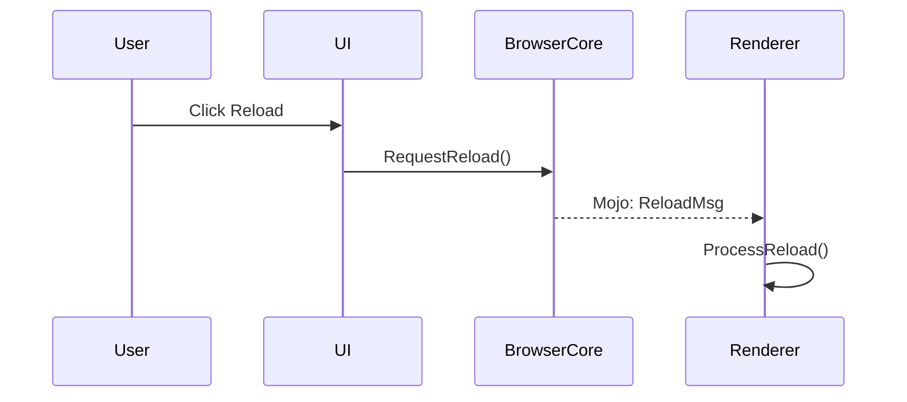

# Onboarding Guide

This file describes the phases for systematically understanding the target codebase. Unlike docforge's `INIT-GUIDE.md`, this file is **not deleted after first use** — phases are revisited as the codebase evolves or as you tackle new subsystems.

The agent reads this file when starting first-time onboarding. After Phase 1 is checked off in `ONBOARD-CHECKLIST.md`, future sessions consult this guide only when re-running a phase.

**This guide is the *process*. `STANDARD.md` is the *target*.** Read `STANDARD.md` first: it defines what professional documentation for a large codebase looks like, using Linux kernel, Chromium, Gecko, and Servo as exemplars, and gives a maturity rubric (L0–L3) to grade your output. Every phase below exists to move one document toward L3.

## Core Principles

Before diving into phases:

1. **Human docs first, code second.** Phase 1 reads only what humans wrote. Code without surrounding context is hard to read in isolation.
2. **Stop between phases.** Phases are interactive. Do not run them back-to-back without user confirmation.
3. **Verify, don't guess.** Tag every claim ✓ / ◐ / ? . Speculation is fine if labeled.
4. **One concept or flow per session.** Depth beats breadth.
5. **CLAUDE.md is for indexes, not encyclopedias.** Detailed knowledge lives in CONCEPTS.md / FLOWS.md.
6. **Write for non-native English readers.** Follow `WRITING-STYLE.md`. Prefer mermaid diagrams for any flow of three or more steps.

## Codebase Scope: One Notes Directory per Codebase

For a single-codebase project, the notes directory tracks the whole repo.

For a **monorepo with multiple distinct subprojects** (backend + mobile + CLI, or kernel + userland), create one notes directory per subproject. Each has its own `AGENT-warm-up.md` with its own `<CODEBASE_PATH>`. See `EXAMPLES.md` → "Monorepo with Multiple Codebases".

For a **fork of an upstream project** (vendor branches, ports), record the upstream relationship in `OVERVIEW.md` under "Fork Tracking". See `EXAMPLES.md` → "Tracking a Fork Against Upstream".

## Model and Tool Recommendations

This template is model-agnostic. Some guidance for getting good results:

- **Phase 1-2 (scanning, labeling):** any capable model. The work is shallow but broad.
- **Phase 3 (reverse recommendation):** a strong model is worth it. The ranking shapes everything that follows.
- **Phase 4 (deep dive):** strong model with extended thinking enabled if available. Slow and careful beats fast and confident.
- **Phase 5 (flow trace):** **always use sub-agents**. Cross-module tracing fills context fast. Have the sub-agent return a summary, not file dumps.
- **Phase 6 (CLAUDE.md distillation):** strong model. This file goes into every future session, so the cost of getting it wrong compounds.
- **Phase 7 (verification):** any model can run the `git log` checks; use a strong model only for the re-confirmation pass.

Tools that compound the agent's effectiveness:

- **ripgrep** (`rg`) — fast text search
- **tokei** or **cloc** — count files and lines per directory (Phase 2)
- **clangd / pyright / rust-analyzer / gopls** — language servers, accurate symbol resolution
- **tree-sitter** — structural search
- **git log -L / git blame** — code history per region (Phase 7)
- **mermaid CLI** (`mmdc`) or [mermaid.live](https://mermaid.live) — render diagrams before committing

---

## Phase 1: Ignorance Scan (No Code)

**Goal:** Understand the project from human-written documents, without opening source code.

### Steps

1. List the files and first-level directories at the codebase root.
2. Read all "self-introduction" content:
   - `README*`, `CONTRIBUTING*`, `ARCHITECTURE*`, `CHANGELOG*`
   - First level of `docs/` (or equivalent)
   - `*.md` files in the root
3. Read build configuration files (do not read source files yet):
   - `package.json`, `Cargo.toml`, `BUILD.gn`, `CMakeLists.txt`, `pyproject.toml`, `go.mod`, `Makefile`, etc.
   - Look for: dependencies, entry points, supported targets

### Output: First Draft of OVERVIEW.md

Answer these four questions, each in 2-3 sentences:

1. **One-sentence positioning.** What is this project, in one sentence?
2. **Problem and audience.** What problem does it solve? Who uses it?
3. **Tech stack and platforms.** What languages, frameworks, and target platforms?
4. **Entry points.** Where does execution start? (main functions, server entry, CLI binaries)

### Done Criteria

- OVERVIEW.md has the four answers
- ONBOARD-CHECKLIST.md Phase 1 ticked
- HANDOFF.md state block updated: `phase1_complete: true`
- HANDOFF.md narrative updated with "next: Phase 2 (Structural Map)"

### Stop Here. Wait for User.

---

## Phase 2: Structural Map (No Explanation)

**Goal:** Build a directory-level map of the project. Do not explain what code does — just label.

### Steps

1. List all first-level directories.
2. Measure size. Use a tool, do not guess:

   ```
   tokei <codebase-path>             # files and lines per language, per dir
   cloc <codebase-path> --by-file    # alternative
   git ls-files | xargs wc -l        # if tokei/cloc not available
   ```

3. For each directory, write **one sentence** describing what it appears to do, based on:
   - The directory name
   - Any README inside it
   - The kinds of files it contains
4. Mark each directory as one of:
   - 🔴 **Largest** (top 5 by file count or lines of code, from the measurement above)
   - 🟡 **Small but core** (referenced from root README or has its own design doc)
   - ⚪ **Skippable for now** (`third_party/`, `vendor/`, `node_modules/`, generated code)
   - 🟢 **Standard** (everything else)

### Output: "Structural Map" Section in OVERVIEW.md

Use a table or tree:

```
src/
  core/        🔴 Main runtime; entry points and event loop
  net/         🔴 Network stack
  ui/          🟡 UI framework abstraction (referenced in README)
  third_party/ ⚪ Vendored dependencies, skip on first pass
  ...
```

### Side Deliverable: Draft HOW-TO.md

Once the build system and entry points are known (Phase 1) and the structure is mapped (Phase 2), draft `HOW-TO.md` — the common first-week tasks (build, run, one test, land a one-line change). This is a **how-to** doc: procedural steps only, no *why*. Draft the commands now; mark its status `◐` and verify each command `✓` the first time you actually run it on a clean checkout. A how-to that has not been run is not yet trustworthy. See `STANDARD.md` → Trait 9.

### Side Deliverable: Draft API.md (provided + consumed surface)

While mapping structure, capture the **interface surface** in `API.md`:

- The **provided API surface** — the public functions/classes/headers, CLI commands,
  endpoints, or entry-point macros this codebase exposes. Mark the ones that are good
  **entry points** for tracing.
- The **consumed library interfaces** — from the dependency list in the build config
  (Phase 1), the slice of each library the code calls directly and the wrapper that
  adapts it.

The **feature → API map** is filled in later, as flows are traced (Phase 5). See
`STANDARD.md` → "Documenting APIs and Interfaces".

### Done Criteria

- OVERVIEW.md has the structural map
- HOW-TO.md drafted (commands may still be `◐` until first run)
- API.md drafted: provided entry points + consumed library interfaces
- ONBOARD-CHECKLIST.md Phase 2 ticked
- HANDOFF.md updated with "next: Phase 3 (Reverse Recommendation)"

### Stop Here. Wait for User.

---

## Phase 3: Reverse Recommendation

**Goal:** Break the circular dependency of "I don't know what I don't know" by having the agent propose what to learn.

### Steps

Based on Phases 1-2, the agent proposes **5 core concepts** the user should understand next, ranked by importance.

For each concept, provide:

- **Why it matters.** Why is this concept central to the project?
- **What you will misunderstand without it.** What goes wrong if the user skips this?
- **Embodying file.** Which 1-2 files best demonstrate this concept? (`path:line` range)
- **Confidence.** Tag ✓ / ◐ / ? for the recommendation itself.

### Output: First Entries in CONCEPTS.md

Add a section per recommended concept, with placeholder content (to be filled in Phase 4).

```markdown
## 1. <Concept Name> [?]

**Why it matters:** ...
**What you will misunderstand without it:** ...
**Embodying file:** `path/to/file.ext:42-87`
**Status:** Proposed in Phase 3, not yet deep-dived.
```

### Done Criteria

- CONCEPTS.md has 5 ranked concepts with placeholders
- ONBOARD-CHECKLIST.md Phase 3 ticked
- User has picked which concept to tackle first
- HANDOFF.md updated with "next: Phase 4 on concept N"

### Stop Here. Wait for User to Pick.

---

## Phase 4: Deep Dive Per Concept

**Goal:** Truly understand one concept, from analogy down to code lines.

This phase runs **once per concept**, not once per onboarding. Repeat as needed.

### Steps

For the user-selected concept:

1. **Everyday analogy first.** Explain the concept without code, using a metaphor from daily life. (1-2 paragraphs)
2. **Identify embodying file(s).** Confirm or revise the file from Phase 3.
3. **Walk through the key lines.** Pick the most important slice (usually 20-30 lines, but use judgment — some concepts span many small functions). Annotate line by line.
4. **Add a mermaid `classDiagram` or `flowchart`** showing how the concept relates to its callers and dependencies. See `EXAMPLES.md` → "Mermaid Class Diagram for a Concept".
5. **Connect to the rest of the system.** Who calls this? What does it call? Reference paths.
6. **Record the verification commit hash.** Run `git -C <codebase> rev-parse --short HEAD` and write the hash into the entry's `Last verified against commit:` field. **Phase 7 cannot detect drift without this hash.**
7. **End with: "What's confusing about this?"** Wait for user follow-up questions.

### Output: Detailed Entry in CONCEPTS.md

Replace the placeholder from Phase 3 with:

```markdown
## 1. <Concept Name> [◐]

**Last verified against commit:** abc1234

### Analogy
...

### Embodying File
`path/to/file.ext:42-87`

### Diagram
(mermaid classDiagram here — tagged ◐ if not run, ✓ if confirmed by running)

### Walkthrough
- Line 42: ...
- Line 50: ...
...

### Connections
- Called by: `caller.ext:120` (Verified ✓)
- Calls into: `callee.ext:300` (Read-only ◐)

### Open Questions Raised
- See OPEN-QUESTIONS.md Q5
```

### Quality Bar

The entry is done when it matches `STANDARD.md` → "What L3 looks like → CONCEPTS.md" and, for a central subsystem, "Documenting a Major Subsystem":

- Opens with the standard header (type, audience, prerequisites, owner, verified commit).
- Leads with a concrete example, then the contract.
- For a load-bearing subsystem, documents the **key data structure** (fields, invariants, lifetime), explains **why it is shaped that way**, and shows a **worked API call**. An entry for a central subsystem missing the data structure or a usage example caps at L2.
- Uses **stable anchors** (`file + symbol + search-string`), not bare line numbers — an agent reader acts on a stale `:LINE` literally.
- States **what the reader would misunderstand without this concept**, including any place the project deviates from the common pattern an agent would assume.

### Done Criteria

- CONCEPTS.md entry is detailed and tagged
- Verification commit hash recorded
- Mermaid diagram present and rendered (confirmed to render without errors)
- New questions added to OPEN-QUESTIONS.md
- ONBOARD-CHECKLIST.md updated with concept name
- HANDOFF.md updated

### Stop Here. Wait for User.

User may pick another concept (loop Phase 4) or move to Phase 5.

---

## Phase 5: Trace a Concrete Flow

**Goal:** Connect abstract concepts to a concrete, user-visible behavior by tracing its full call chain.

### Steps

1. **Propose 3 candidate flows** appropriate for new-onboarder understanding. Examples by project type:
   - Browser: "Press reload", "Open new tab", "Load a URL"
   - Kernel: "System call enters", "Page fault handling", "Process fork"
   - Game engine: "Frame rendered", "Input event dispatched", "Asset loaded"
   - Web framework: "HTTP request lifecycle", "Database query path"
2. User picks one.
3. **Trace using sub-agent / Explore mode.** Don't include raw file contents in the main conversation. The sub-agent returns:
   - Step-by-step call chain (file:line for each step)
   - Function names at each step
   - Cross-process / cross-thread boundaries
   - Where async / IPC / queues are involved
4. **Render the result as a mermaid `sequenceDiagram` (default)** plus a numbered call-chain table. The diagram is for fast comprehension; the table is for grep and citation.
5. **Record the verification commit hash** in the flow entry.

### Output: Entry in FLOWS.md

```markdown
## Flow: <User-Visible Action>

**Last verified against commit:** abc1234

### Trigger
User does X (e.g., presses reload button)

### Diagram


### Call Chain
| # | File:Line | Symbol | Verification |
|---|---|---|---|
| 1 | `chrome/browser/ui/reload_button.cc:55` | `HandleClick()` | ✓ |
| 2 | `content/browser/web_contents/web_contents_impl.cc:1200` | `Reload()` | ◐ |
| ... | | | |

### Cross-Module Boundaries
- Step 2 → 3: chrome/ to content/ layer
- Step 5 → 6: Browser process to renderer (Mojo IPC)

### Verification
- Steps 1-4: ✓ Verified by reading code
- Steps 5-7: ◐ Read-only, not run in debugger
- Step 8 onward: ? Speculation, see OPEN-QUESTIONS Q9
```

### Quality Bar

This is the "Life of a Pixel" artifact — the single highest-value document for a large codebase (see `STANDARD.md`). Follow Chromium's real lesson: **choose one canonical path and omit aggressively** — do not trace everything. The flow is done when a reader could **set a breakpoint at any step from the citation alone**, knows which steps cross a process or thread boundary, can tell IPC from a direct call, and can see the **primary error / early-exit branch** (where readers actually get stuck). That is the L3 bar for FLOWS.md.

### Done Criteria

- FLOWS.md has at least one full flow
- Mermaid sequence diagram present and rendered
- Tagged for verification
- Verification commit hash recorded
- API.md "Feature → API map" gains a row for this flow: the feature, its entry-point API, the consumed interfaces it uses, and a link back to this flow
- ONBOARD-CHECKLIST.md Phase 5 ticked
- HANDOFF.md updated

### Stop Here. Wait for User.

---

## Phase 6: Distill into CLAUDE.md

**Goal:** Produce a lean, ≤200-line CLAUDE.md that goes into every future session.

### What CLAUDE.md IS

- An **index** to the rest of the docs
- The 5-10 things that, if not known, cause everything else to be misunderstood
- Project conventions that affect every interaction (build commands, file naming, code organization)
- Pointers, not full content

### What CLAUDE.md IS NOT

- A copy of OVERVIEW.md, CONCEPTS.md, or FLOWS.md
- A glossary of every term
- A code style guide (use linters)
- A list of every file

### Steps

1. Write CLAUDE.md with these sections:
   - **Project in one paragraph**
   - **Core concepts to know** (3-5 bullets, each linking to CONCEPTS.md)
   - **Top-level architecture in 5 lines**
   - **Where to look for what** (table mapping common tasks to files/dirs)
   - **Build / test / run commands**
   - **Project conventions** (file naming, module boundaries that aren't obvious)
   - **Pointers to detailed docs**

2. Verify line count: `wc -l CLAUDE.md`. If over 200, cut.

3. **Author or refresh `INDEX.md`** — the entry point for consuming skills. Write its tables from `CONCEPTS.md`, `FLOWS.md`, and `HOW-TO.md`: the concept/flow/data-structure map, the **task→location map**, the **invariants registry**, and the commands. Confirm every row points at a section that exists, then run `tools/check-index.sh` to verify it covers every concept and flow. This is what lets another skill fix a bug or write a design doc from the docs. See `STANDARD.md` → "The Docs as a Knowledge Base for Other Skills".

4. Read CLAUDE.md aloud to yourself and ask: "Is every line earning its place in every future session's context window?" Cut anything that fails.

5. **Run the gate in `STANDARD.md` → "Definition of Done for the Whole Notes Directory".** This is the moment to check the document set against the bar, not just CLAUDE.md against its line count. Walk the *Amateur Tells* list too. Fix what fails before declaring Phase 6 done.

6. Update the HANDOFF.md state block: set `state: continuing`.

### Done Criteria

- CLAUDE.md ≤200 lines (verified by `wc -l`)
- INDEX.md built; every row points at a section that exists; invariants registry filled
- Cross-links to OVERVIEW, CONCEPTS, FLOWS, OPEN-QUESTIONS
- `STANDARD.md` "Definition of Done" gate walked; failing items fixed or logged
- ONBOARD-CHECKLIST.md Phase 6 ticked
- ONBOARD-GUIDE.md NOT deleted (unlike docforge's INIT-GUIDE)
- HANDOFF.md state block shows `state: continuing`

---

## Phase 7: Verification (Recurring)

**Goal:** Catch documentation drift as the upstream codebase evolves.

Run this phase periodically — every few weeks, or after the upstream codebase has had significant commits.

### Steps

0. **Run the drift check first.** `tools/check-doc-drift.sh` (see `tools/README.md`) lists which notes cite code paths that changed since the last verification. This narrows the manual work below to exactly the entries at risk. In CI, this runs on every pull request that touches the codebase.

1. For each file path referenced in CONCEPTS.md and FLOWS.md:
   - Read the "Last verified against commit: <hash>" annotation. If the annotation is missing, the entry was not properly recorded in Phase 4 or 5 — flag it.
   - Run `git -C <codebase> log <hash>..HEAD -- <file_path>`.
   - If the file has been modified, mark its containing entry as 🟡 **drift suspected**.

2. For each ✓ Verified entry:
   - Re-confirm the claim still holds against current code.
   - If yes: update the verification commit hash.
   - If no: downgrade to ◐ or ?, add to OPEN-QUESTIONS.md.

3. For each entry in OPEN-QUESTIONS.md:
   - Has it been answered by recent commits, blog posts, or other docs?
   - If yes: move resolution into the relevant CONCEPTS.md or FLOWS.md entry, mark Q as resolved.

4. **Re-sync `INDEX.md`.** For every row, confirm the anchor still resolves and the
   target section still exists. Update any status tag that changed in steps 1–3. A
   stale index is dangerous: a consuming skill acts on it. Pay special attention to
   the invariants registry — a removed or changed invariant must be corrected here.

5. Update the HANDOFF.md state block: set `last_verified_commit` to the current short hash.

### Output

- Updated commit hashes on verified entries
- Drifted entries flagged
- OPEN-QUESTIONS.md cleaned up
- INDEX.md re-synced (anchors resolve, statuses current, invariants registry correct)
- HANDOFF.md state block `last_verified_commit` updated

### Done Criteria

- All ✓ entries either re-verified or downgraded
- HANDOFF.md notes the verification date
- HANDOFF.md state block `last_verified_commit` updated

---

## When to Re-Run Phases

| Trigger | Re-Run Phase |
|---|---|
| New major subsystem to learn | Phase 4 (one concept) or Phase 5 (one flow) |
| Upstream had big commits | Phase 7 |
| Confused by something new | Phase 4 with that as the concept |
| Found a bug, want to understand context | Phase 5 with the bug's flow |
| CLAUDE.md feels stale or bloated | Phase 6 |
| Joined a new team subsystem | Phase 1-3 scoped to that subsystem |

---

## Anti-Patterns

Watch for these. If you catch yourself doing any of them, stop.

- **Phase-skipping.** Jumping to Phase 4 without Phase 1-2 means the agent has no map and will get lost.
- **CLAUDE.md bloat.** Adding everything you learn into CLAUDE.md. It is an index, not a wiki.
- **Marking entries verified without verifying them.** Reading the code is not the same as running it. Use ✓ only when you confirmed by running, debugging, or an authoritative doc.
- **Over-recommendation.** Phase 3 should produce 5 concepts, not 25. Force yourself to rank.
- **Solo agent runs.** If the agent runs Phase 1-6 without user interaction, the user learned nothing — the agent did. Stop between phases.
- **Forgetting to tag.** Untagged claims look the most authoritative and rot the fastest.
- **Skipping the hash.** A CONCEPTS.md entry without `Last verified against commit:` cannot be drift-checked in Phase 7. The information is effectively unverified from that point forward.
- **Unrendered diagrams.** Mermaid fails silently on syntax errors. A broken diagram is worse than no diagram.
