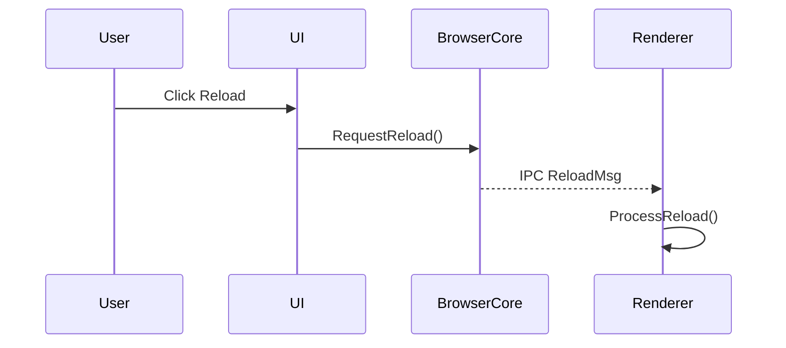

# Writing Style

Documents in this directory are read by developers from many countries, often as a second language. They are also re-read by AI agents across sessions. Both audiences benefit from the same writing rules.

This file applies to every Markdown document in this notes directory. A document is not stable until it passes the self-check at the end of this file.

## Hard Rules

1. **Short sentences.** Aim for under 20 words. One idea per sentence.
2. **Active voice.** Write "The browser sends a request." Not "A request is sent by the browser."
3. **Concrete nouns over metaphors.** Say what something is, not what it is like. The one exception is Phase 4 deep-dive analogies, which are intentional teaching tools.
4. **Define every term on first use** in a document, even if it seems obvious. The reader may have skipped earlier sections.
5. **No culturally-specific idioms.** Replace them with literal phrasing:

   | Avoid | Use instead |
   |---|---|
   | chicken-and-egg problem | circular dependency |
   | low-hanging fruit | easy first step |
   | smoking gun | direct evidence |
   | verification theater | marking entries verified without verifying them |
   | code is a maze | code without context is hard to read in isolation |
   | rabbit hole | scope that expands without bound |
   | boil the ocean | try to do everything at once |

6. **No phrasal verbs when a single verb works.** "Find" not "track down". "Remove" not "get rid of". "Start" not "kick off".
7. **Prefer common words.** "Use" not "utilize". "Show" not "demonstrate". "Help" not "facilitate". "Before" not "prior to".

## Structural Rules

- Lead with the conclusion, then the evidence. Readers scan; do not bury the point.
- Use lists when the items are parallel. Use prose when they are not.
- Tables for comparisons. Lists for steps. Prose for explanations.
- Headings describe the content, not the activity. Write "Phase 1: Read Human Docs" not "Phase 1: Reading What Humans Wrote".
- Paragraphs of more than five sentences should be split or converted to a list.

## Diagrams

A diagram often communicates faster than prose, especially for non-native readers. Default to [mermaid](https://mermaid.js.org/) for any flow with three or more steps. Mermaid renders natively on GitHub, GitLab, and most documentation hosts.

Use this matrix to choose a diagram type:

| Use case | Mermaid type |
|---|---|
| Phase 5 flows (cross-module call chains, IPC) | `sequenceDiagram` |
| Concept relationships (which classes own which) | `classDiagram` |
| State machines (request lifecycle, session states) | `stateDiagram-v2` |
| High-level architecture in OVERVIEW.md | `flowchart TD` (top-down) |
| Build / test / release pipeline | `flowchart LR` (left-right) |

When you add a diagram:

- **Tag it with the same verification mark** (✓ / ◐ / ?) as a prose claim. A confidently rendered diagram looks more authoritative than the same claim in prose, so the verification discipline matters more, not less, for diagrams.
- **Render it before committing.** Mermaid fails silently on syntax errors. Paste the source into [mermaid.live](https://mermaid.live) or run `mmdc` locally.
- **Pair it with a table** of the same information. The diagram is for comprehension; the table is for grep and citation.

Example:

| # | File:Line | Symbol | Verification |
|---|---|---|---|
| 1 | `ui/reload_button.cc:55` | `HandleClick()` | ✓ |
| 2 | `browser/web_contents.cc:1200` | `RequestReload()` | ◐ |

## Review

A document is not "done" until a human technical writer (or someone who reads English as a second language) has reviewed it. Track this in the `Doc quality` column of `ONBOARD-CHECKLIST.md`.

The AI agent may produce a first-pass simplification. A human review is required before a document is treated as authoritative.

## Self-Check Before Committing

Read the document aloud as if English is your second language. Flag and fix:

- [ ] Any sentence longer than 25 words
- [ ] Any idiom that would not translate to another language
- [ ] Any term used without a definition
- [ ] Any paragraph longer than five sentences
- [ ] Any diagram without a verification tag
- [ ] Any diagram you have not rendered to confirm syntax
- [ ] Any claim about code without a `path:line` citation
