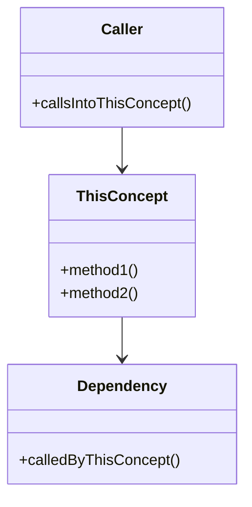

# Core Concepts

> Filled in **Phase 3** (recommendation list with placeholders) and **Phase 4** (deep dives). Each concept gets its own section.

## How to Read This Document

Every concept entry has:

- A **tag** showing verification status
  - ✓ **Verified** — read code AND confirmed by running/debugging or authoritative doc
  - ◐ **Read-only** — read code/docs but didn't run/test
  - ? **Speculation** — inferred, not confirmed
- An **embodying file** with `path:line` reference
- A **last-verified commit hash** for drift tracking
- **Connections** to other concepts and files

When code and this document disagree, the code wins. Update this doc; do not ignore the discrepancy.

---

## Recommended Concepts (from Phase 3)

> The agent fills this list during Phase 3. Each concept starts as a placeholder; deep-dive (Phase 4) replaces the placeholder with the full entry below.

### 1. _<Concept Name>_ [?]

- **Why it matters:**
- **What breaks without it:**
- **Embodying file:** `path/to/file.ext:LINE-LINE`
- **Status:** Proposed in Phase 3, not yet deep-dived.

### 2. _<Concept Name>_ [?]

- (same structure)

### 3. _<Concept Name>_ [?]

### 4. _<Concept Name>_ [?]

### 5. _<Concept Name>_ [?]

---

## Deep Dives (Phase 4)

> One section per concept after deep-dive. Replace the corresponding placeholder above with a back-reference (e.g., "See Deep Dive: <name> below").

### Concept: _<Name>_

**Doc type:** explanation (concept / data structure)
**Audience:** _(who needs this concept; what they already know)_
**You are assumed to know:** _(prerequisite concepts)_
**Before you begin:** _(none, or "read Concept #X first")_
**Owner:** _(who keeps this true)_
**Anchor:** `path/to/file.ext` → `SymbolName` (search `"<stable search string>"`)
**Last verified against commit:** _(short hash — required. Phase 7 cannot drift-check without it.)_   **Status:** ✓ / ◐ / ?
**Last verified date:** _(YYYY-MM-DD)_

> Prefer a stable anchor (`file + symbol + search-string`) over a bare
> `path:line`. Line numbers drift, and an agent reader acts on a stale one
> literally. See `STANDARD.md` → "Writing for Agent Readers".

#### Concrete Example First

_(Show one real call, command, or value before any abstraction. The reader pattern-matches off the concrete. Keep it short.)_

#### Analogy

_(1-2 paragraphs. Explain without code, using a metaphor from daily life. This is the one place idiomatic language is encouraged — analogies are teaching tools. The rest of the entry should follow `WRITING-STYLE.md`.)_

#### Plain-Language Explanation

_(2-4 paragraphs. What it does, why it exists, how it fits into the system. Short sentences. Define every term on first use.)_

#### Key Data Structure (required for a load-bearing subsystem)

_(For a central subsystem, the data structure IS the design. Skip this section only if the concept has no significant data structure. See `STANDARD.md` → "Documenting a Major Subsystem" and the worked `task_struct` entry in `EXAMPLES.md`.)_

Anchor: `path/to/header.ext` → `StructName` (search `"<stable search string>"`).

| Field | Type | Role | Invariant / lifetime |
|---|---|---|---|
| | | | |

**Why it is shaped this way:** _(tie each structural choice to the constraint that forced it — memory, concurrency, performance, compatibility. Include the rejected alternative only if recoverable from history or comments; otherwise mark it `?`. Never invent a rationale.)_

#### API Usage (required if there is a public-ish API)

_(Real calling code. Explain the non-obvious calls by the rationale above — the reader should see the design pay off in how the API must be called.)_

```
<minimal worked example calling into this concept>
```

#### Deviation Callout (for agent readers)

_(State where this departs from the common pattern an agent's prior would assume — e.g., "intrusive list, not container-of-pointers." Omit if there is no surprising deviation.)_

#### Diagram

_(A mermaid `classDiagram` or `flowchart` showing how this concept relates to its callers, dependencies, and sibling concepts. Tag with ✓ / ◐ / ?.)_



**Diagram verification:** ◐ Read-only — confirmed by reading source, not by running.

#### Code Walkthrough

```
path/to/file.ext:42-87
```

- **Line 42–48:** _(what this block does)_
- **Line 50–55:** _(...)_
- **Line 60–72:** _(...)_

> Avoid pasting the full code block here. Reference line numbers and summarize.

#### Connections

- **Called by:** `caller_a.ext:120` ✓, `caller_b.ext:88` ◐
- **Calls into:** `dependency.ext:300` ◐
- **Related concepts:** Concept #2, Concept #4
- **Related flows:** See FLOWS.md → "Flow Name"

#### Open Questions Raised

- See OPEN-QUESTIONS.md → Q3, Q5

#### Notes / Surprises

_(Things that didn't fit elsewhere. Often becomes useful later.)_

---

### Concept: _<Next Name>_

_(repeat structure)_

---

## Cross-Reference Index

A shortcut for finding "which concept does file X belong to."

| File / Path | Concept(s) |
|---|---|
| `path/to/file.ext` | Concept #1, #4 |
| | |
