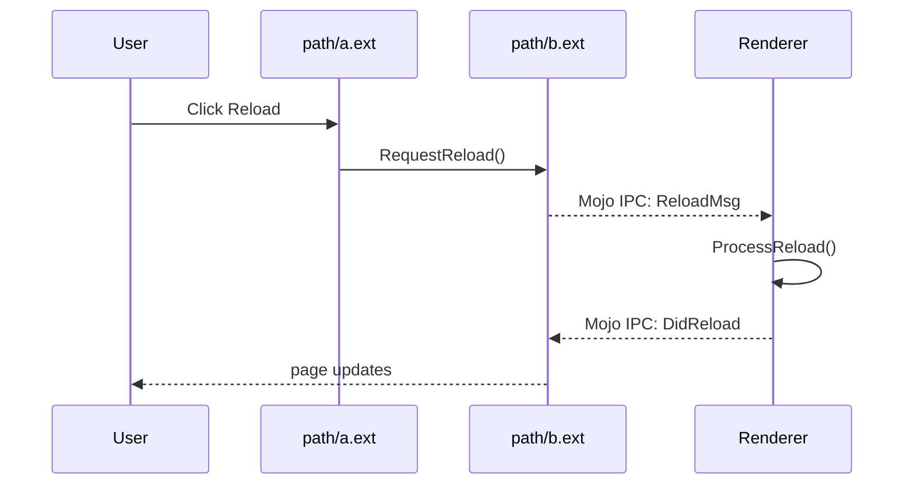

# Flows

> Filled in **Phase 5**. Each flow is a concrete, user-visible behavior traced through the codebase as a call chain.

## How to Read This Document

A "flow" answers the question: **when the user does X, what code runs, in what order, across which modules?**

Each flow entry has:

- A **trigger** — what user action or external event starts it
- A **call chain** — ordered steps with `path:line` references
- **Cross-module / cross-process boundaries** marked
- **Verification tags** per step
- **Last verified against commit** for drift tracking

Flows are how abstract concepts (CONCEPTS.md) connect to concrete behavior. If a concept makes no sense, finding it in a flow often clarifies it.

---

## Flow: _<User-Visible Action>_

**Doc type:** explanation (traced flow)
**Audience:** _(who needs to follow this path; what they already know)_
**Before you begin:** _(none, or prerequisite concepts / build)_
**Owner:** _(who keeps this true)_
**Trigger:** _(what starts this — a button click, a network packet, a timer fires, etc.)_
**Last verified against commit:** _(short hash — required. Phase 7 cannot drift-check without it.)_   **Status:** ✓ / ◐ / ?
**Last verified date:** _(YYYY-MM-DD)_

> Follow Chromium's "Life of a Pixel" lesson: **choose one canonical path and omit
> aggressively.** Trace one action well; do not trace every branch. The one branch
> you must include is the primary error path below.

### Sequence Diagram (Required)

A mermaid `sequenceDiagram` is the default for every flow. Render it before committing — mermaid fails silently on syntax errors.

**Diagram verification:** ◐ Read-only — same tag rules as prose claims. A confidently rendered diagram looks more authoritative than the same claim in text, so verify with the same discipline.

### Call Chain

The table is for grep, citation, and detail. The diagram above is for fast comprehension.

| # | File:Line | Function / Symbol | Verification |
|---|---|---|---|
| 1 | `path/a.ext:55` | `HandleClick()` | ✓ |
| 2 | `path/b.ext:120` | `RequestReload()` | ◐ |
| 3 | `path/c.ext:300` | `IPC::Send(ReloadMsg)` | ◐ |
| 4 | _(cross-process boundary)_ | | |
| 5 | `other_proc/d.ext:80` | `OnReloadMessage()` | ? |
| 6 | … | | |

### Cross-Module / Cross-Process Boundaries

| Step → Step | Boundary Type | Mechanism |
|---|---|---|
| 2 → 3 | Module: UI → Browser core | Direct call |
| 3 → 5 | Process: Browser → Renderer | Mojo IPC |

These boundaries are usually where bugs hide. Flag them clearly.

### Primary Error / Early-Exit Branch (required for L3)

Where readers actually get stuck is the failure path, not the happy path. Document
at least the main one.

- **Where it diverges:** _(step number above, and the `file + symbol` of the branch)_
- **What triggers it:** _(the condition — bad input, timeout, permission, etc.)_
- **Literal error signal:** _(the exact error string / status / log line, so an agent reader can match it)_
- **Where it ends up:** _(returned error, retry, user-visible message)_

### Open Questions Raised

- See OPEN-QUESTIONS.md → Q?

### Related Concepts

- See CONCEPTS.md → "Concept Name"

### Notes

_(What surprised you about this flow? Anything counterintuitive?)_

---

## Flow: _<Next Action>_

_(repeat structure)_

---

## Flow Index

| Flow Name | Trigger | Status |
|---|---|---|
| | | |
