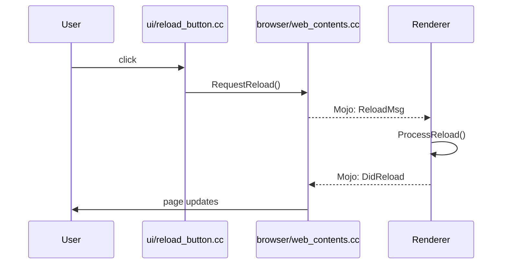
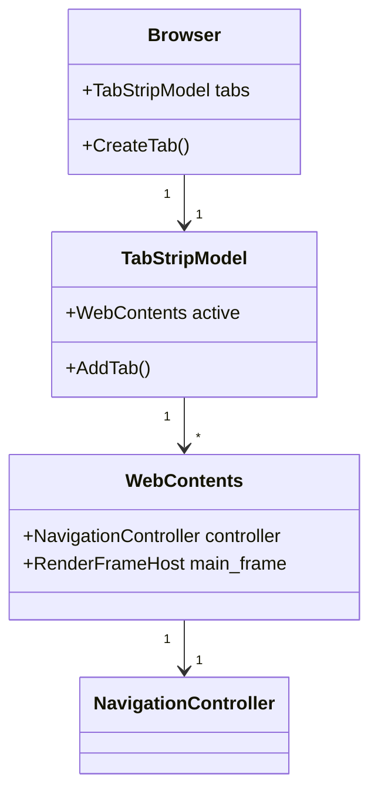

# Examples

Concrete examples of how this template is used on real codebases. These are illustrative only. Do not copy them into your own notes; they belong here, not in your project's working files.

## Example: Chromium Subsystems Tracker

A Chromium-scale codebase is too large to onboard as a single unit. Track progress per subsystem in `ONBOARD-CHECKLIST.md` under "Subsystems Tackled":

| Subsystem / Path | Phases Completed | Status |
|---|---|---|
| Top-level architecture | 1, 2, 3, 6 | ✅ Stable |
| `net/` | 1, 2, 4 (URLRequest), 5 (URL load) | 🟡 Partial |
| `content/browser/` | 1, 4 (RenderProcessHost) | 🟡 Partial |
| `third_party/blink/` | — | ☐ Not yet |
| `v8/` | — | ☐ Not yet |

## Example: Monorepo with Multiple Codebases

For repositories that contain several distinct projects (for example, a backend service plus a mobile client plus a CLI tool), create one notes directory per codebase rather than one notes directory for the whole monorepo. Set `<CODEBASE_PATH>` in each `AGENT-warm-up.md` to the specific subtree.

```
my-monorepo-notes/
  backend-notes/        # docforge-onboard template, CODEBASE_PATH = ../my-monorepo/backend
  mobile-notes/         # docforge-onboard template, CODEBASE_PATH = ../my-monorepo/mobile
  cli-notes/            # docforge-onboard template, CODEBASE_PATH = ../my-monorepo/cli
  README.md             # Index pointing to each notes dir
```

If you must use a single notes directory for the whole monorepo, treat each subproject as a "subsystem" in `ONBOARD-CHECKLIST.md` and prefix all `path:line` citations with the subproject root.

## Example: Tracking a Fork Against Upstream

For a fork (for example, a vendor branch of Chromium, a WebKit port, or an Android system image), `OVERVIEW.md` should include a "Fork Tracking" section:

```markdown
## Fork Tracking

- **Upstream repository:** https://chromium.googlesource.com/chromium/src
- **Last sync commit:** abc1234 (2026-01-15)
- **Branch divergence:**
  - `chrome/browser/our_feature/` — added by us, not upstream
  - `net/url_request/url_request.cc` — diverges from upstream after line 420 (custom retry logic)
  - `third_party/blink/renderer/` — synced with upstream, no local changes
- **Re-sync policy:** Pull from upstream every 6 weeks; resolve in `chrome/browser/our_feature/`.
```

This section is more important than current code structure for understanding why things look the way they do.

## Example: Mermaid Sequence Diagram for a Flow

This is how a Phase 5 flow appears in `FLOWS.md`:



Paired with the call-chain table:

| # | File:Line | Symbol | Verification |
|---|---|---|---|
| 1 | `ui/reload_button.cc:55` | `HandleClick()` | ✓ |
| 2 | `browser/web_contents.cc:1200` | `RequestReload()` | ◐ |
| 3 | (Mojo IPC boundary) | — | ◐ |
| 4 | `renderer/page.cc:340` | `OnReloadMessage()` | ? |

## Example: Mermaid Class Diagram for a Concept

This is how a `CONCEPTS.md` deep-dive can show ownership relationships:



This communicates ownership relationships faster than a prose description, especially for readers whose first language is not English.
