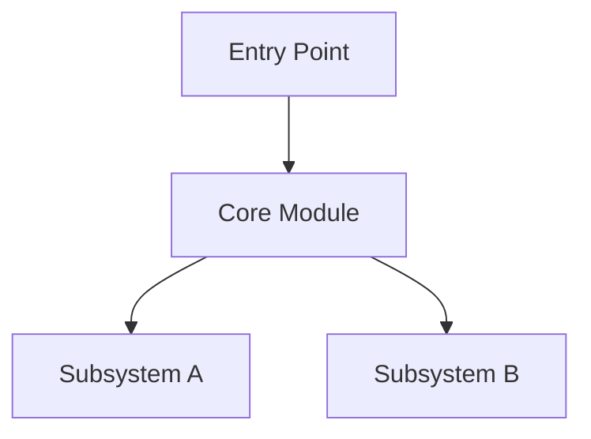

# Project Overview

> Filled in **Phase 1** (one-sentence positioning, problem, stack, entry points) and **Phase 2** (structural map). Revised whenever Phase 7 catches drift.

**Last verified against commit:** _(short hash, filled in at Phase 1 completion and at each Phase 7 re-verification)_
**Last verified date:** _(YYYY-MM-DD)_

## One-Sentence Positioning

_(Phase 1 — what is this project, in one sentence?)_

## Problem and Audience

_(Phase 1 — 2-3 sentences. What problem does it solve? Who uses it?)_

## Tech Stack and Platforms

- **Language(s):**
- **Frameworks / runtimes:**
- **Target platforms:**
- **Build system:**
- **Test framework:**

## Entry Points

Where does execution actually start?

| Entry | Path | Notes |
|---|---|---|
| Main binary | | |
| CLI tool(s) | | |
| Server / daemon | | |
| Test runner | | |

## Structural Map (Phase 2)

First-level directory layout. One sentence per directory. Marker shows priority for onboarding:

- 🔴 Largest / most code mass
- 🟡 Small but core (referenced from README, has its own design doc)
- ⚪ Skippable on first pass (vendored, generated)
- 🟢 Standard

```
<root>/
  ?           ?  ?
  ?           ?  ?
```

_(Replace ? with actual directories and descriptions during Phase 2.)_

### Largest 5 directories

| Dir | LOC / files | Role in one line |
|---|---|---|
| | | |

### Small but core directories

| Dir | Why core | Where it's referenced |
|---|---|---|
| | | |

### Directories to skip on first pass

| Dir | Reason |
|---|---|
| | |

## Project History (Optional)

If the codebase has a known history that affects how to read it (e.g., "originally a fork of X", "was rewritten from Java to Rust in 2022"), note it here. This is often more important than current code structure for understanding why things look the way they do.

## Fork Tracking (If Applicable)

Fill this section only if the codebase is a fork of an upstream project (vendor branches, ports, downstream distributions). Skip otherwise.

- **Upstream repository:** _(URL)_
- **Last sync commit:** _(short hash, date)_
- **Branch divergence:**
  - _(path) — added by us, not upstream_
  - _(path) — diverges from upstream after line N (describe local change)_
  - _(path) — synced with upstream, no local changes_
- **Re-sync policy:** _(how often, who owns it, where conflicts are most likely)_

For a worked example, see `EXAMPLES.md` → "Tracking a Fork Against Upstream".

## Top-Level Architecture Diagram (Optional)

A `flowchart TD` mermaid diagram showing the major components and their relationships. Add after Phase 2. Tag with verification mark.



## Notes and Surprises

Things you noticed in Phase 1-2 that didn't fit elsewhere. Examples:

- Unexpected directory naming conventions
- Inconsistencies between README and actual code structure
- Multiple build systems coexisting
- Documentation that contradicts itself

These often become OPEN-QUESTIONS.md entries.
